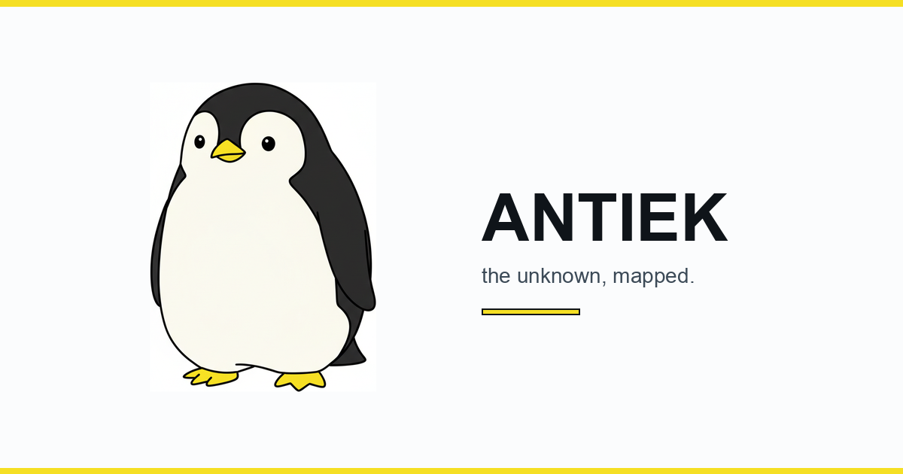

# apps/reading/

<p align="center">
  
</p>

The TS side of the polyglot seam (`architecture_notes §11`). After the
S0–S12 redesign (`docs/ui_redesign_posthog/`), this app is the
Antarctic-themed Werner-the-penguin operator surface: a brand-outlined
panel-system shell with a literate notebook editor, layered persistence,
and a popout-capable workspace.

Brand reference: `docs/ui_redesign_posthog/brand_werner.html`.
Programme retrospective: `docs/ui_redesign_posthog/RETRO.md`.
Per-sprint specs: `docs/ui_redesign_posthog/sprint_{00..12}_*.html`.

## Stack

- **Vite 5 + React 18 + TypeScript strict** — no `any`, no implicit
  any in JSX, no missing prop types.
- **Tailwind 3** with the Antiek brand extension (`tailwind.config.js`
  exposes `sun`, `ice-0..9`, `ink`, `void`, `bright`, `aurora`,
  `emperor`, `shadow-z1..z3`, `border-edge`, `rounded-hog`, etc.).
- **Zustand 5** for workspace state (`src/workspace/WorkspaceStore.ts`).
- **Framer Motion 11** for floating-panel transitions only.
- **TipTap 3** (`@tiptap/react` + `starter-kit` + custom Antiek blocks)
  for the notebook editor — code-split, only loaded when the editor opens.
- **HTML reader** for canonical document rendering and region selection.
- **Storybook 8** + **Lost-Pixel 3** for the design-system source of
  truth and visual regression (124 baselines under `.lostpixel/baseline/`).
- **Vitest 4** + **@testing-library/react** + **jsdom** for unit tests
  (64 cases as of S12 — workspace store, layout logic, persistence,
  shortcuts, Lemon primitives).
- Generated types from `tools/codegen/emit_types.py` — **never hand-edit
  `src/generated/types.ts`**; regenerate from the Pydantic schemas.

## Architecture map

```
src/
  main.tsx                    React entry (+ VITE_ANTIEK_UI env flag)
  App.tsx                     <Routes>; popout window at /_panel/:id
  AppShell.tsx                NavRail + Topbar + PanelLayout + Toast
  PanelWindowApp.tsx          Popout window app (no shell chrome)

  design/
    tokens.ts                 sun, surface, shadow, werner, accent, type
    tokens.css                CSS-var sibling for non-Tailwind consumers
    moodboard.stories.tsx     The brand source of truth in Storybook

  brand/werner/
    poses/                    Krea-generated PNGs (PIL-locked to #F5DF24)
    marks/                    Favicon + avatar + social-card derivatives

  components/
    lemon/                    10 brand primitives + barrel index.ts
      LemonButton, LemonCard, LemonModal, LemonInput, LemonTextarea,
      LemonTag, LemonSelect, LemonDropdown, LemonTable, LemonToast
      + PrimitivesShowcase.stories.tsx
    navigation/
      NavRail.tsx             60px icon column (Werner mark + route icons)
      Topbar.tsx              breadcrumbs + ⌘K search + account
      ProjectTree.tsx         left-dock panel (pinned/recent/all)
    CommandPalette.tsx        ⌘K palette (routes + 5 search sources +
                              workspace actions)
    AISidecar.tsx             slide-over thought-partner panel
    HtmlReaderPanel.tsx       canonical HTML reader + region selection
    ClaimCard.tsx             claim chip with challenge + add-to-notebook
    …

  workspace/                  THE PANEL SYSTEM
    panel.types.ts            PanelKind + PanelDescriptor + WorkspaceSnapshot
    WorkspaceStore.ts         Zustand store + persistence subscriber
    panelLayoutLogic.ts       pure layout math (z-stacking, clamp, defaults)
    PanelLayout.tsx           orchestrator (left/right/bottom docks + floating)
    PanelLayoutPanel.tsx      renders one panel (floating motion / docked CSS)
    PanelHandle.tsx           drag grip + pin + kebab dropdown
    PanelRegistry.tsx         PanelKind → React.lazy(() => import(…))
    persistence.ts            localStorage scopes + URL ?ws= encoder
    useWorkspaceHydration.ts  apply global→route→investigation→URL on nav
    shortcuts.ts              ⌘K, ⌘B, ⌘/, ⌘[, ⌘], ⌘W, G+I/W/N/R
    actions.ts                openNotebook, openReader, openClaimInspector
    popout.ts                 window.open + BroadcastChannel sync
    usePrefersReducedMotion.ts
    useViewportTier.ts        xl/lg/md/sm breakpoint tier

  modes/                      ROUTE-LEVEL SURFACES
    ResearchWorkstation/      Mode A — InvestigationSidebar + Chat + Chase
    WrestleApp/               Mode B — HTML reader + Notes + CrossDocs
    Notebook/                 Mode F — substrate-backed notebook (legacy)
      Editor.tsx              TipTap editor (S7-full)
      blocks/                 5 custom NodeView blocks (claim-card,
                              region-embed, note, cross-doc-link,
                              master-section)
      SlashMenu.tsx           "/" trigger menu
      EditorPanel.tsx         PanelKind="NotebookEditor" wrapper
    {Backtest, Billing, …}    list/index routes (render in main slot;
                              no PanelHost wrap — opt-in per S10-STATUS.md)

  api/                        REST helpers (substrate posts/gets)
  lib/                        auth, synthesisParser, hash, fetch helpers
  generated/                  AUTO-GENERATED types — regen from Python

scripts/
  check_bundle.ts             post-build gzipped-chunk-budget assertion

.storybook/                   Storybook config + addon-a11y + tokens
.lostpixel/                   124 visual-regression baselines + config
```

## Run

```bash
# Terminal 1 — Python substrate (FastAPI on :8000)
cd ~/Desktop/Antiek && source .venv/bin/activate
uvicorn interfaces.research.api.app:app --reload --port 8000

# Terminal 2 — Vite dev server (React on :5173)
cd ~/Desktop/Antiek/apps/reading
npm install            # first time only
npm run dev
```

Open <http://localhost:5173>. Sign in (magic-link) at `/login` if the
session cookie isn't already present.

## Scripts

```bash
npm run dev               # Vite dev server with HMR
npm run build             # tsc -b && vite build → dist/
npm run build:check       # build + scripts/check_bundle.ts (700 KB ceiling)
npm run typecheck         # tsc -b --noEmit
npm test                  # vitest run
npm run storybook         # Storybook on :6006
npm run visualtest        # Lost-Pixel diff against .lostpixel/baseline/
npm run visualtest:update # rebaseline (commit the .png changes)
```

## Operator-visible features (post-S12)

- Werner mark anchored in NavRail; ink left-bar highlights active route.
- Topbar breadcrumbs + ⌘K search + account dropdown.
- Floating panels: drag the handle, resize from the corner, ESC closes
  when focused (S3 acceptance), viewport edges clamp dragged position.
- Dock to left / right / bottom via the kebab; kbd hints (⌘B, ⌘W)
  shown alongside.
- Pop out into a real OS window (via `window.open` + BroadcastChannel
  sync); close to re-dock at the popout's last position.
- Persistent layout across reloads — per-route + per-investigation
  scopes layered at hydration.
- `?ws=<base64>` shareable layout URLs (Cmd+K → "Copy shareable layout").
- Notebook editor (TipTap): 5 custom blocks + slash menu + autosave
  to localStorage + optimistic-concurrency conflict detection.
- Werner brand palette: layered glacial whites by day, ten-step night
  sky by night (OS-preference driven).
- Reduced-motion guards (`prefers-reduced-motion: reduce`).
- Viewport-tier responsive: docks collapse below 1024 / 768.

## Keyboard reference (S8 + S11)

| Combo | Action |
|---|---|
| ⌘K (or ⇧⌘P) | Open command palette |
| ⌘B | Toggle Project tree panel |
| ⌘/ | Toggle AI sidecar |
| ⌘[ / ⌘] | Cycle focused panel |
| ⌘W | Close focused floating panel |
| Esc | Close focused floating panel (when not in an editor) |
| G → I | Navigate to /investigations |
| G → W | Navigate to /wrestle |
| G → N | Navigate to /notebooks |
| G → R | Navigate to / (research) |
| / | Inside the notebook editor — open slash menu |

## Bundle budget

```
main `index.js`              ≤ 700 KB gz (current ~437 KB; ~246 KB headroom)
panel lazy chunks            <  20 KB gz each
TipTap notebook editor       ~ 130 KB gz (lazy; only when editor opens)
```

`npm run build:check` enforces.

## Discipline

`architecture_notes §11.2`: this package only translates DOM events
into typed substrate events + renders substrate events into DOM
updates. The workspace store + persistence layer are the principled
exception: they describe operator workspace ergonomics, not substrate
state. Everything else goes through `postTypedEvent` + generated REST.
