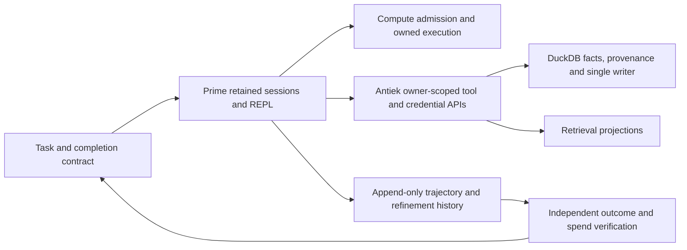

# Prime Agent implementation audit, 10 October 2026

Antiek has useful Prime process, credential and accounting boundaries. Its current
application adapter does not yet provide the persistent recursive engine described
in the supplied materials. This change repairs the managed process completion
boundary. It does not activate tools, replace the installed agent or migrate sessions.

## Scope and method

The operator requested implementation work informed by four primary sources:

- [On the Nature of the Swarm](https://www.primeintellect.ai/blog/on-the-nature-of-the-swarm)
- [Rewriting Prime Agent in Rust](https://www.primeintellect.ai/blog/prime-agent-rust)
- [Prime Agent repository](https://github.com/PrimeIntellect-ai/prime-agent/tree/763094e1b6a7c17450ee8399b06cda1853847ca5)
- [Prime Agent paper, version 1](https://arxiv.org/html/2608.23552v1)

`READ` means source inspection. `RAN` means an executed local control with a
retained result. `OBS` means observed metadata. `INF` marks a conclusion drawn
from those premises. Source analysis alone does not certify runtime behavior.

All source acquisition, delegated analysis and tests used compute. Implementation
used an isolated clone. No production service, installed harness, credentials,
user sessions, private documents, account policy or provider was changed.

### Env Card

| Field | Value |
|---|---|
| Antiek baseline | `d4b7caf2ffac0df7890ce4333d225e45c20e10b9` |
| Upstream baseline | `763094e1b6a7c17450ee8399b06cda1853847ca5` |
| Source branch | `fix/prime-rpc-completion-20261010` |
| Test interpreter | Existing Antiek CPython 3.12 venv |
| Synthetic process interpreter | Same venv, selected through explicit PATH |
| Test database | Existing conftest private temporary database isolation |
| LLM on reproduced failure paths | No |
| Delegated source reviewers | Subscription agent lanes admitted through compute |
| Live model/provider checks | Not run |

The four source pages were captured with response URL, byte count and SHA-256.
The local audit directory contains baseline metadata, raw controls, JUnit,
static results and the decision log. It is evidence storage, not an Antiek runtime.

## Baseline and contradictions

`OBS`: the launcher resolves to a managed **0.9.8** release. Its adjacent package
metadata describes the TypeScript/Bun distribution. A native executable filename
does not establish that the installed implementation is Rust. The upstream
checkout is Rust. Its [legacy upgrade contract](https://github.com/PrimeIntellect-ai/prime-agent/blob/763094e1b6a7c17450ee8399b06cda1853847ca5/docs/legacy-upgrade-contract.md)
separates published TS stable releases from Rust prereleases and artifact parity.
No installed-binary checksum or Rust migration test was performed here.

`READ`: the swarm article argues for retained specialist contexts and peer
communication because summaries lose information and repeated reconstruction
costs work. It does not establish that more agents always help. That supports
stable specialist identities with explicit task ownership, rather than launching
a fresh expert for every question. [Swarm article](https://www.primeintellect.ai/blog/on-the-nature-of-the-swarm)

`READ`: the Rust article describes protocol, transcript, feature and terminal-frame
comparisons, followed by alternating baseline/candidate performance measurements.
Its timings use scripted model responses and exclude inference. They are useful
methodology and upstream results, not measurements of Antiek, its machine or its
provider latency. [Rust article](https://www.primeintellect.ai/blog/prime-agent-rust)

`READ`: the paper distinguishes active context, persistent REPL/child state and
durable history/refinement. Stable identity can survive recovery while external
processes and nonserializable values require reconstruction. Autonomous budgets,
goals and scheduled turns have different completion semantics. This audit does
not reproduce the reported benchmark results. [Paper](https://arxiv.org/html/2608.23552v1)

`READ`: Antiek's `PrimeAgentRLMBackend.run_session` launches a one-shot print
process. Its arguments disable sessions, tools, extensions and skills. Its
session label and stable goal text do not retain an upstream REPL or child context.
See [prime_agent_backend.py](../../orchestration/rlm/prime_agent_backend.py).

`READ`: `providers/prime_agent.py` discards `max_tokens` and `temperature`; the
requested model labels the workflow but is not passed to that print invocation.
Unreported usage is honestly marked unreported. However, billing an estimated
ceiling is not a mechanism that enforces the discarded generation limit. The
accounting decision's stronger spend-bound wording needs reconciliation with
the actual invocation. See [provider](../../substrate/dispatch/providers/prime_agent.py)
and [existing decision](../decisions/prime-agent-usage-ceiling.md).

## Failure Dossier

The reproduced defects are in `PrimeAgentManagedProcess.read_line`, below both
the RPC protocol and its usage ledger.

| ID | Baseline behavior | Control | Result after repair |
|---|---|---|---|
| P1 | Reaped leader plus stdout EOF can return completion before queued stderr is checked | Child emits terminal, waits for stdin EOF, closes stdout, writes 129 stderr bytes; parent reaps before exit drainage | A 128-byte cap refuses the overflow |
| P2 | A complete LF record returns before its record-size check | 65-byte complete record with a 64-byte cap | Refused before return; exact 64-byte record and next record survive |
| P3 | Closed stderr remains in the readiness set and stays readable forever | Child closes stderr before a real ready record, then waits for stdin; real select calls are counted | EOF descriptor is retired; the next wait blocks until its deadline |
| P4 | NaN/infinite deadlines and boolean/fractional byte caps pass config validation | Actual config construction with invalid boundary values | Rejected before process creation |

`RAN`: the first new suite had **10 failures and 7 passes**. A synchronized P3
control then failed independently, observing **130,162 select calls** during its
150 ms wait. That number is a result from this isolated run, not a fleet estimate.

The repair records stdout/stderr EOF separately, removes each closed descriptor,
checks complete LF-inclusive record length, drains both streams and directly
waits for the leader before returning clean completion. Config limits must be
finite, and byte caps must be positive actual integers. Existing credential
selection, private HOME, artifact staging and process-group retirement are preserved.

### Scope Map

| Entry point | Evidence in this change | Limit |
|---|---|---|
| Managed RPC reads and terminal drainage | New real synthetic-process controls | Does not prove a real provider response |
| Metered `invoke_prime_rpc_evidence` | Existing RPC/wire/ledger controls | Does not certify every upstream protocol version |
| One-shot print process config | Existing process/backend controls plus new limit controls | Does not enable persistent RLM tools |
| Credential owner/payer and accounting | Existing owner/ledger regressions | No production credential or settlement tested |
| Native artifact staging | Existing synthetic bundle regressions | Installed binary probe deliberately deselected |

## Upstream contracts that Antiek must not strengthen by assumption

These are `READ` findings from selected Rust source. Proposed failure controls
below were not executed against an upstream daemon.

| Contract | Exact source-backed qualification | Required Antiek control |
|---|---|---|
| Retained task identity | A child handle precedes prompt completion. Follow-ups do not reopen the original run status. [host](https://github.com/PrimeIntellect-ai/prime-agent/blob/763094e1b6a7c17450ee8399b06cda1853847ca5/crates/pa-daemon/src/rlm_children/host.rs), [usage](https://github.com/PrimeIntellect-ai/prime-agent/blob/763094e1b6a7c17450ee8399b06cda1853847ca5/crates/pa-daemon/src/rlm_children/usage.rs) | Separate task/message IDs from durable session IDs; complete and follow up twice across worker replacement |
| Restart recovery | Child reseeding restores topology with degraded status; queues drop some live attachment/admission fields. [registry](https://github.com/PrimeIntellect-ai/prime-agent/blob/763094e1b6a7c17450ee8399b06cda1853847ca5/crates/pa-daemon/src/rlm_children/registry.rs), [queue](https://github.com/PrimeIntellect-ai/prime-agent/blob/763094e1b6a7c17450ee8399b06cda1853847ca5/crates/pa-daemon/src/worker/queue.rs) | Crash at admission, dequeue, external effect and settlement; fence duplicate effects and disclose lost attachments |
| Cancellation | Registry cancellation marks status before a best-effort abort; it does not prove process death or side-effect rollback. [registry](https://github.com/PrimeIntellect-ai/prime-agent/blob/763094e1b6a7c17450ee8399b06cda1853847ca5/crates/pa-daemon/src/rlm_children/registry.rs) | Drop abort transport and require separate confirmed retirement before releasing resources |
| Refinement rollback | Inverse edits restore old snapshots; planning conflict checks use the current planning baseline. An old rollback may erase later edits. [planner](https://github.com/PrimeIntellect-ai/prime-agent/blob/763094e1b6a7c17450ee8399b06cda1853847ca5/crates/pa-core/src/refinement/planner.rs) | Create, update, then rollback the create; require a current-state precondition or explicit reviewed compensation |
| Usage durability | Child cursor advances before attribution append; append failure can lose attribution. Recovery primes at the transcript tail. [usage](https://github.com/PrimeIntellect-ai/prime-agent/blob/763094e1b6a7c17450ee8399b06cda1853847ca5/crates/pa-daemon/src/rlm_children/usage.rs) | Inject append failure and reconcile against independent raw model receipts; unknown spend must stay unknown |
| Aggregate semantics | Descendant cost/token aggregates are cumulative replacements. Parent context-token count has a different meaning. [rlm_usage](https://github.com/PrimeIntellect-ai/prime-agent/blob/763094e1b6a7c17450ee8399b06cda1853847ca5/crates/pa-core/src/session_engine/rlm_usage.rs) | Two children, follow-ups, repeated collection and deletion; no double-summing snapshots or billing context size |
| Collection and notices | `list` is a local snapshot; `collect(0)` can still make worker RPCs. Terminal notice delivery is best effort. [host](https://github.com/PrimeIntellect-ai/prime-agent/blob/763094e1b6a7c17450ee8399b06cda1853847ca5/crates/pa-daemon/src/rlm_children/host.rs), [lifecycle](https://github.com/PrimeIntellect-ai/prime-agent/blob/763094e1b6a7c17450ee8399b06cda1853847ca5/crates/pa-daemon/src/rlm_children/lifecycle.rs) | Hang worker refresh; distinguish snapshot, result, notice delivery and confirmed quiescence |

The detailed independent trace inspected 29 Rust source files. It did not audit
the entire upstream repository. These qualifications are not demonstrated exploits.

## Architecture to preserve

`INF`: the engine should retain computational context while Antiek owns the
permissions, evidence and economic consequences of using that context.

Tasks, retained session context, canonical product facts and execution leases need
different identities. A task tracker cannot restore a REPL. A REPL variable cannot
grant a private-document read. A usage counter cannot grant a provider credential.
Refinement memories cannot replace the original signed policy or transaction evidence.

The account owner and payer must join the selected credential, model and operation
before a provider call. Tool-enabled sessions need account-scoped working directories,
an explicit tool inventory and controlled writes through Antiek's existing APIs.
Upstream workers run with environment permissions; process separation alone is not
a tenant sandbox. See [upstream README](https://github.com/PrimeIntellect-ai/prime-agent/blob/763094e1b6a7c17450ee8399b06cda1853847ca5/README.md).

## Verification and residuals

`RAN`: final new suite **17 passed**. Existing scoped suites **148 passed,
1 deselected, 2 subtests passed**. Ruff and strict mypy pass on both changed Python
files. The existing installed-binary probe was excluded deliberately; no installed
Prime execution is claimed. Existing assertions were not changed.

### Gate results

| Gate | Actual result | Qualification |
|---|---|---|
| New managed-completion controls | 17 passed | Real synthetic children; no installed Prime or provider call |
| Existing process, bundle, RPC, wire, authority, accounting and RLM controls | 148 passed; 1 deselected; 2 subtests passed | The real installed-bundle probe was deliberately deselected |
| Ruff, stock formatting and strict mypy | All passed | Changed Python paths only; test formatting preserved the complete AST |
| Source preservation | 6,031 unallocated baseline Git tuples unchanged | Three function units changed; all existing tests and 21 other function units unchanged; no physical whole-tree census |
| Scoped security projection | Exit 0; zero real findings; four advisories | Six selected implementation/context files; not whole-application security certification |

Raw logs, JUnit, registration, source comparisons and reviewer reports are retained
in `.audit/prime-agent-forensic-implementation-20261010/evidence/`. The new selector
is `tests/test_prime_agent_managed_completion.py`. Existing selectors cover
`test_prime_agent_process`, `test_prime_agent_native_bundle`,
`test_prime_rpc_evidence`, `test_prime_agent_wire_contract`,
`test_prime_agent_authority_ledger`, `test_prime_owner_accounting`,
`test_prime_agent_usage_unreported`, `test_prime_agent_rlm_backend`,
`test_prime_agent_rlm_embed` and `test_dispatch_bootstrap_prime_agent`.

The independent review found no mandatory current completion defect. It did not
authenticate the baseline diff itself; baseline membership is established by this
change's separate Git comparison. Its residuals are retained:

- Buffered records can return before checking the read deadline. Final clean
  completion still checks the deadline. This is not a hard real-time bound.
- Cleanup has small reap waits and synchronous filesystem work. No global
  descendant/process-tree retirement certificate is implied.
- The evidence invocation explicitly retires the process group. Bare managed
  `close()` has a narrower guarantee when the leader already exited.
- Invalid RPC limits can reach the durable launch claim before config rejects
  them. Move validation earlier in a separately reviewed RPC-boundary change.
- The pre-spawn hook sits outside lease-release handling. Interrupt behavior
  needs a real cleanup regression before changing the separately held staging region.

### Not proved

Installed Rust parity; retained RLM execution through Antiek; real provider budget
enforcement; production tenant isolation of arbitrary tools; upstream crash,
cancellation and rollback controls; measured Antiek performance improvements;
full live research or reading journey. Passing local process controls proves none
of these by itself.

## Verdict and next steps

The managed RPC completion defect is repaired and covered by real private controls.
The engine adoption gap remains explicit. The next implementation sequence is:

1. Validate RPC limits before consuming a launch claim; prove rejection leaves
   authorization, credential resolver and process launch untouched.
2. Pin a candidate Rust artifact and compare actual print/RPC records and owned
   daemon shutdown against the installed TS release on isolated state. Preserve
   current live sessions and keep rollback available.
3. Implement retained session/task mapping with continuation, replacement and
   cancellation controls. Keep names separate from generation IDs.
4. Bind real model selection, generation limits, account-owned credentials and
   cumulative descendant spend before enabling tool-capable product work.
5. Require restart/idempotency and refinement conflict controls before trusting
   durable status as completed work. Then benchmark cold/warm startup and process
   tree memory with alternating trials and identical scripted workloads.

### Status

One scoped implementation and forensic report prepared for normal review. Root
retains receiving, merge and deployment. No installed upgrade or provider activation.

### Files touched

`runtime/prime_agent/process.py`, new completion tests and this diagnostic only.
Package staging, private-daemon helpers, provider flags, lockfiles and old tests
remain unchanged.

### Decisions mid-flight

Repair the reproducible completion boundary first. Preserve unknown state instead
of promoting status, EOF or a usage estimate into a stronger success claim.

### Milestones

Captured and pinned the four primary sources; reproduced baseline process failures;
implemented the completion repair; passed the new and preserved controls; completed
the independent source trace, finite diff review and scoped security projection.
Normal PR gates, receiving review and deployment remain separate milestones.

### Assumptions surfaced

Installed release metadata is not binary provenance. A child status is not confirmed
retirement. Two EOFs are not successful RPC settlement. An estimated usage ceiling
is not enforced spend. A private process HOME is not a tenant sandbox. Each stronger
claim requires its own concrete verifier and authority join.

### Out-of-scope temptations

No global launcher replacement, live session migration, tool activation, account
policy change, provider spend or modification of the separately held staging and
private-daemon algorithms. The report identifies their exact dependencies rather
than treating this process repair as permission to change them.

### Steelman rejected alternative

Updating the global binary and enabling tool-rich swarms immediately would expose
live sessions and account data to an unproved protocol and execution boundary.
The measured local defects can be repaired without that migration.

### Open questions

What exact Rust artifact replaces the live TS release? Which account-scoped tool
set and current pricing contract govern product agents? The code and tests above
do not answer those deployment choices.

### Next sprint can start when

The owned RPC limits change has a concrete contract, or the Rust migration has an
isolated artifact/session verifier. Current source acceptance is not that verifier.
