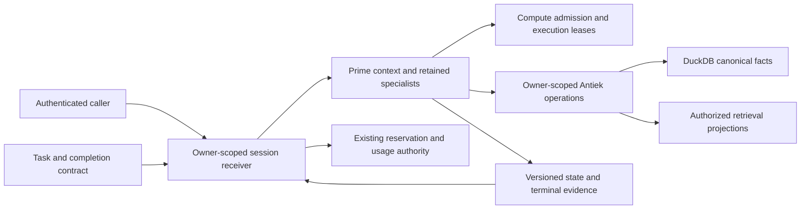

# Prime RPC preflight and retained-session contract

This continues the [four-source Prime audit](https://github.com/Slimydog21/Antiek/pull/3797)
on a separate, current-main branch. It repairs an authority-ordering defect and
defines the remaining Antiek receiving contract. It does not replace Prime,
change live sessions or enable application tools.

The operator uses Prime as Antiek's core harness. The application adapter examined
here is a separate integration: it returns supplemental evidence through print
or single-call RPC. Its missing retention bindings do not prove that the operator's
running Prime fleet lacks retained sessions.

## Scope and evidence

`READ` means inspected source; `RAN` means a retained executed control; `OBS` means
observed metadata; `INF` means a conclusion drawn from those facts. Proposed controls
are not results. Primary materials remain:

- [On the Nature of the Swarm](https://www.primeintellect.ai/blog/on-the-nature-of-the-swarm)
- [Prime Agent Rust rewrite](https://www.primeintellect.ai/blog/prime-agent-rust)
- [Prime repository at 763094e1](https://github.com/PrimeIntellect-ai/prime-agent/tree/763094e1b6a7c17450ee8399b06cda1853847ca5)
- [Prime Agent paper v1](https://arxiv.org/html/2608.23552v1)

| Baseline | Exact value |
|---|---|
| Current Antiek main at admission | `d4b7caf2ffac0df7890ce4333d225e45c20e10b9` |
| Branch | `fix/prime-rpc-preflight-20261010` |
| Prior disjoint stream fix | PR #3797, `16f19d446ededbbc88081a54d1aebe7c65e60e99` |
| Interpreter | Existing CPython 3.12 Antiek venv |
| Execution | Compute-admitted private synthetic processes and SQLite |
| Project isolation | Original conftest and canonical-before-private environment bindings |
| Live Prime/provider/production checks | Not run |

An independent retained-session trace read seven selected files, 108,512 bytes,
from the prior `16f19d44` carrier. Its report was source-only and did not inspect
ledger storage. This continuation separately inspected the existing ledger and
ran real private reservation/settlement controls. Neither review is a complete
upstream, installed-artifact or fleet audit.

## Reproduced defect and implementation

`READ`: `invoke_prime_rpc_evidence` originally checked positivity and the relative
record/total bound. Python comparisons allowed NaN, infinity, positive booleans
and fractional byte caps through that check. Credential resolution and
`ledger.mark_started` then happened before process-config validation. Depending on
the value, the call could launch, fail after claiming, or return without the
required preflight refusal.

`RAN`: the 36-case baseline had **14 failures and 22 passes**. Each case used either
a new request or a genuinely reserved private SQLite authorization. The failures
covered NaN/infinite timeout, positive boolean timeout, boolean/fractional record
limits and boolean/fractional total limits. Existing zero, negative and
total-smaller-than-record refusal arms passed.

An independent review found a second source-derived hazard: a positive `Decimal`
timeout passed the first guard and caused float-plus-Decimal deadline construction
to fail after the launch claim, outside the exception handler. A new extended
control phase reproduced **14 failures and 6 passes**, with the original 36 cases
deselected. Unsupported timeout types also produced inconsistent error types.

The final implementation admits exact built-in integer/float timeouts, converts
once to the immutable float used downstream, maps conversion overflow to the
existing preflight error, and checks finite positivity. It requires actual integer
record and total caps before comparing their ranges. This strengthens the existing
pre-authorization guard; it does not relocate a later check. The guard runs before
the clock callback, ledger authorization, credential
resolution and durable launch claim. No protocol, accounting, replay, credential
or process algorithm changes.

`RAN`: all **56 new controls passed**. They establish zero clock/resolver calls,
no RPC launch, byte-identical private ledger contents, unchanged events and
either continued absence or continued `AUTHORIZED` state. Each then performs a
real valid RPC call with the same authorization and verifies one launch, complete
evidence, exact settlement and no prompt/key bytes in the ledger. These controls
prove rejection does not consume that authorization; they do not execute a real
provider. Synthetic installation version/help probes happen during fixture setup;
the denial controls do not claim that no setup executable was invoked.

The unchanged RPC, wire, authority, owner-accounting and unreported-usage suites
add **61 passes**, for **117 passing tests** in the final changed-source run. Ruff,
stock-formatting and strict project mypy passed on both changed Python paths.
All existing tests and assertions remain unchanged.

The final six-file security projection returned exit 0, zero real findings and
four advisories. It included the exact final RPC and test bytes plus unchanged
authority, ledger, installation and process context. It is a scoped scan, not
whole-application security certification. The independent reviewer authenticated
the first guard's byte delta, found the Decimal hazard, and supplied source findings;
the reproduced extended controls and final Git inverse establish this correction.
No independent final runtime acceptance is inferred from that review.

## Contracts that must stay separate

The swarm material supports retained specialist context and direct communication.
The paper distinguishes active context, retained REPL/children and durable history.
These motivate explicit session lifetimes and context versions, not implicit
authority from a session name. The Rust rewrite's parity-first comparison method
is appropriate for an eventual artifact migration. Its performance claims are not
Antiek measurements.

| Contract | Current inspected implementation | Required receiving join |
|---|---|---|
| Caller authority | RPC owner/payer are validated identifiers and resolver bindings | Derive the principal from actual authentication; prove authority for owner, payer and operation |
| Retained identity | Print request has no session ID; RPC authorization session ID is not a Prime daemon handle | Bind an opaque owner-scoped Prime session to the existing accounting session and daemon generation |
| Actual model | Print uses the requested model in local labels only; RPC passes and checks provider/model | Record and verify actual resolution, with explicit authorized changes and no ambient fallback |
| Credential account | RPC matches credential owner/payer/fingerprint; print injects no explicit provider credential | Bind payer-authorized credential provenance without persisting private HOME or secret environment |
| Effective context | Print session method concatenates goal and iteration; the RPC digest covers one prompt | Bind goal, previous state, compaction revision and permitted context sources to the next turn |
| Turn completion | RPC needs correlated terminal records, clean process exit and ledger settlement | Use a durable per-turn result/state/usage receipt while the daemon remains alive; an ACK is insufficient |
| Concurrency | One isolated process executes one RPC; wire IDs repeat as `1` and `2` | Fence stale generations and revisions; map unique wire requests to existing idempotency keys |
| Tools | Both inspected paths disable tools/extensions/skills/context autoload | Retention alone changes no tool permissions; every action still crosses an authenticated Antiek API |

Sources: [backend](../../orchestration/rlm/prime_agent_backend.py),
[provider](../../substrate/dispatch/providers/prime_agent.py),
[RPC](../../orchestration/rlm/prime_rpc_evidence.py),
[authority](../../orchestration/rlm/prime_authority.py),
[ledger](../../orchestration/rlm/prime_ledger.py),
[process](../../runtime/prime_agent/process.py) and
[installation](../../runtime/prime_agent/installation.py).

The print provider is not routed through the inspected RPC reservation ledger.
Its content-derived request ID repeats across identical model/prompt pairs and
does not bind an authenticated owner. It discards requested `max_tokens` and
`temperature`; its usage is honestly unreported. Charging an estimated ceiling
does not enforce the discarded generation limit. These are separate integration
defects to resolve before treating print output as a metered retained engine.

The seven-file trace found no create/attach/resume receiver in that selected
integration. That is a bounded source finding. Historical private-daemon work and
the operator's external fleet are not disproved by it or transferred by this PR.

## Minimal retained-session receiving design

This is an implementation contract proposal, not an implemented authority issuer.
Reuse the existing ledger and verified artifact identities. Do not add another
spend database or substitute a matching dictionary for authenticated authority.

1. **Attach.** Authenticate the caller, join owner/payer/credential/actual model,
   and bind the Antiek session to an opaque Prime session, daemon generation,
   artifact digest and explicit execution/context profile. A filesystem path is
   not an access token.
2. **Admit a turn.** Require the expected context revision, exact prompt/goal/profile
   digests, request/idempotency/nonce bindings and existing unresolved liabilities.
   Serialize active work per session revision. Refuse stale or altered requests
   before inference; return the existing result for an exact retry.
3. **Accept the result.** Join actual model/usage, output digest, prior/next durable
   state revision and existing ledger success before exposing accepted evidence.
   Keep admission, inference-finished, state-durable, settled and delivered distinct.
4. **Reopen or retire.** Recheck ownership and current credential/profile/artifact
   compatibility, fence the old generation and preserve unknown spend. Context
   deletion does not refund liabilities or prove process retirement.

`INF`: task tracking, execution admission, computational context, canonical facts
and retrieval projections need distinct responsibilities. This avoids using a
task status as a result verifier, a retained context as a private-data grant or a
retrieval cache as canonical truth. The diagram proposes those joins; it does not
certify their current end-to-end wiring.

Required controls for a retained receiver include cross-owner attach refusal,
two-turn state continuity, duplicate delivery without duplicate inference,
concurrent stale-revision refusal, changed credential/model/context refusal,
terminal-without-durable-state refusal, settlement failure, compaction/reopen
identity, cancellation with unconfirmed retirement and bounded retained bytes.
All are **unrun** here. The upstream source qualifications for recovery,
best-effort cancellation, refinement rollback and attribution durability remain
in the preceding audit.

## Verification limits and next work

The implementation offers one numeric guard and new private controls. It preserves
all other RPC bytes and every unallocated baseline Git tuple. PR #3797 remains a
separate stream-completion change; no old test grade is borrowed here. Raw evidence
is in `.audit/prime-agent-rpc-preflight-20261010/evidence/`.

Not proved: installed Rust parity, real account/provider usage, enforcement of the
print adapter's generation/spend limit, live session migration, retained application
execution, arbitrary-tool tenant isolation or a performance improvement. Numeric
preflight does not authenticate self-asserted identifiers or create tool authority.

The next safe implementation requires an exact supported daemon API/artifact and
the existing account/credential owner joins. Test its receiver and migration in
isolated state before changing the installed engine. Root retains normal receiving,
merge and deployment. No provider, live session, account policy or canonical
database was changed by this work.
